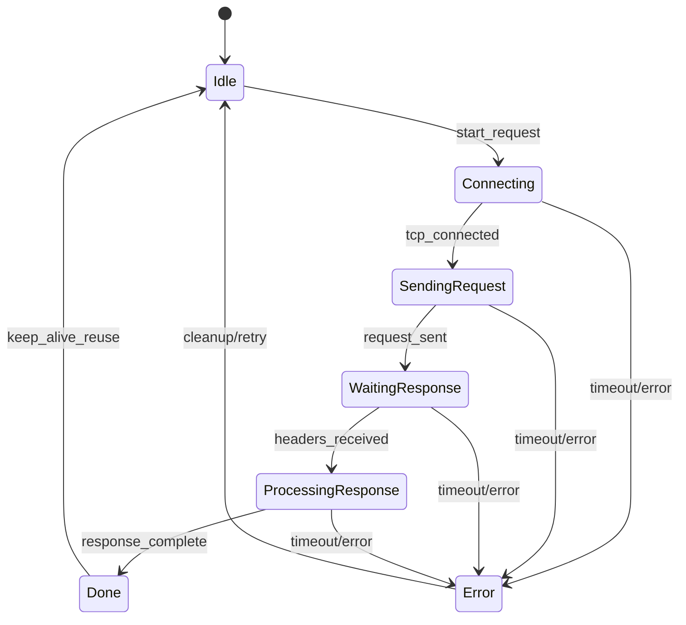

For the general model (components, Mealy/Moore, etc.), see [[State Machine]].

## Definition

A **Finite State Machine (FSM)** is a model of computation with:

- a finite set of states,
- transitions between states,
- inputs/events that trigger transitions,
- and optional actions on transition/state entry.

## Why It Matters in Networking

- Many protocols are easier to reason about as state machines.
- Helps define valid/invalid sequences of messages.
- Makes implementation and debugging more systematic.

## Example: HTTP Request Flow (Client Perspective)

For a simple HTTP request, a client can be modeled as:

1. **Idle**
2. **Connecting**
3. **SendingRequest**
4. **WaitingResponse**
5. **ProcessingResponse**
6. **Done** (or back to `Idle` for keep-alive reuse)

Possible transitions:
- `start_request` : `Idle -> Connecting`
- `tcp_connected` : `Connecting -> SendingRequest`
- `request_sent` : `SendingRequest -> WaitingResponse`
- `headers_received` : `WaitingResponse -> ProcessingResponse`
- `response_complete` : `ProcessingResponse -> Done`
- `timeout/error` : from multiple states to an error/cleanup path

### Diagram

## Notes

- HTTP itself is stateless at the application protocol level, but client/server implementations still use internal FSMs for connection/request handling.
- Similar FSM modeling is used heavily for [[Transmission Control Protocol (TCP)]] connection states.

## Related Concepts

- [[State Machine]]
- [[HTTP]]
- [[Transmission Control Protocol (TCP)]]
- [[Client]]
- [[Server]]
- [[Application]]
