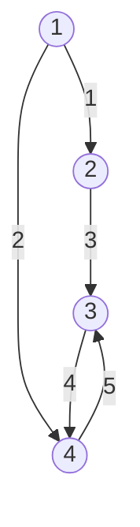

For a [[graph]] with $n$ vertices (nodes) and $m$ (directed) edges or links, the **incidence matrix** is an $n \times m$ [[Matrices|matrix]] $A$ where:

$$ A_{ij} = \begin{cases}
1 & \text{if edge } j \text{ points to node } i \\
-1 & \text{if edge } j \text{ points from node } i \\
0 & \text{otherwise}
\end{cases} $$

## Example
For a graph with $n = 4$ vertices and $m = 5$ edges:

The incidence matrix is:
$$ A = \begin{bmatrix}
-1 & -1 & 0 & 0 & 0 \\
1 & 0 & -1 & 0 & 0 \\
0 & 0 & 1 & -1 & -1 \\
0 & 1 & 0 & 1 & 1
\end{bmatrix} $$

## Properties

1. **Structure**:
   - Each column corresponds to one edge
   - Each column contains exactly one 1 and one -1
   - All other entries are 0

2. **For Undirected Graphs**:
   - Can use 1 for incident edges (connected)
   - 0 for non-incident edges
   - No negative values needed

3. **Sum Properties**:
   - Sum of each column is 0
   - Row sums give net edge count (in-degree minus out-degree)
